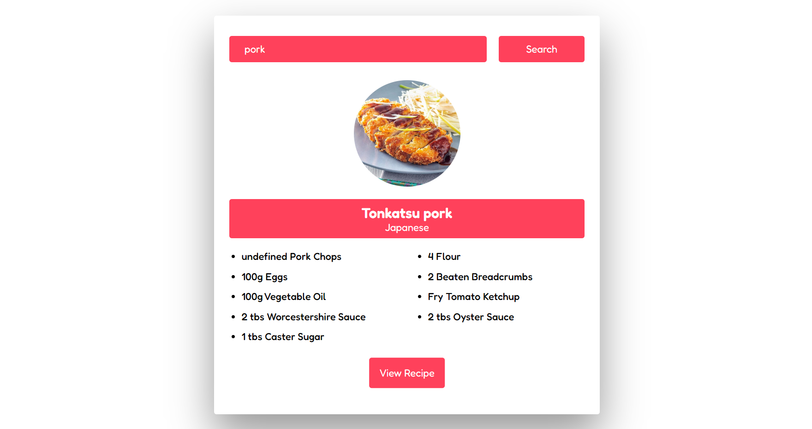

# Recipe App

Welcome to the Recipe App repository! This project is a JavaScript-based web application designed to showcase recipe steps for various dishes. Built with HTML, CSS, and JavaScript, it uses the MealBD API for recipe information and features a modern UI design for an intuitive and user-friendly experience.

## Preview



## Features

- **Recipe Steps:** Access detailed steps for preparing a variety of dishes.
- **MealBD API Integration:** Fetch recipe information dynamically for a diverse culinary experience.
- **Modern UI Design:** Sleek layout and visually appealing design for an enjoyable user interface.

## Getting Started

To run the Recipe App locally, follow these steps:

1. Clone the repository to your local machine:

   ```bash
   git clone https://github.com/Devsethi3/Recipe-App.git
   ```

2. Open the `index.html` file in your preferred web browser.

## Usage

1. Enter the name of the dish you want to explore in the search bar.
2. Click the "Search" button to fetch and display the recipe information.
3. Explore the recipe steps to prepare the dish.

## API Used

This project utilizes the [MealBD API](https://www.themealdb.com/api.php) to fetch recipe information.

## Customization

Feel free to customize this project to fit your preferences. Update styles, colors, and layout in the HTML and CSS files. You can also extend the functionality to include additional features or customization options.

## Contributing

If you'd like to contribute to this project, please follow these steps:

1. Fork the repository.
2. Create a new branch for your feature or improvement.
3. Make your changes and commit them with descriptive messages.
4. Push your changes to your forked repository.
5. Open a pull request to merge your changes into the main branch.

Explore the Recipe App, discover new dishes, and consider contributing to its development. Thank you for checking out the repository!